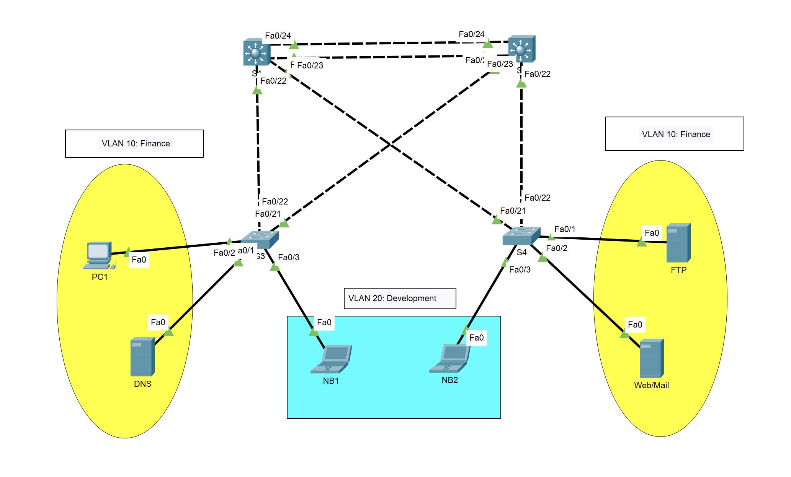

# Ex2

* 小型局域网

## 拓补图



## 以太通道

* S1

```log
Switch>ena
Switch#conf
Configuring from terminal, memory, or network [terminal]? 
Enter configuration commands, one per line.  End with CNTL/Z.
Switch(config)#interface range fastEthernet 0/23-24
Switch(config-if-range)#channel-group 1 mode on
Switch(config-if-range)#
Creating a port-channel interface Port-channel 1

%LINK-5-CHANGED: Interface Port-channel1, changed state to up

%LINEPROTO-5-UPDOWN: Line protocol on Interface Port-channel1, changed state to up

Switch(config-if-range)#
```

* S2

```log
Switch>ena
Switch#conf
Configuring from terminal, memory, or network [terminal]? 
Enter configuration commands, one per line.  End with CNTL/Z.
Switch(config)#interface range fastEthernet 0/23-24 
Switch(config-if-range)#channel-group 1 mode on
Switch(config-if-range)#
Creating a port-channel interface Port-channel 1

%LINK-5-CHANGED: Interface Port-channel1, changed state to up

%LINEPROTO-5-UPDOWN: Line protocol on Interface Port-channel1, changed state to up

Switch(config-if-range)#
```

## 设置接口的Trunk模式

* S1

```log
Switch(config)#int port-channel 1
Switch(config-if)#switchport trunk encapsulation dot1q 
Switch(config-if)#switchport mode trunk 
```

* S2

```log
Switch(config)#int port-channel 1
Switch(config-if)#switchport trunk encapsulation dot1q
Switch(config-if)#switchport mode trunk
```

## VTP管理VLAN

* S1设置Server

```log
Switch#vlan database
% Warning: It is recommended to configure VLAN from config mode,
  as VLAN database mode is being deprecated. Please consult user
  documentation for configuring VTP/VLAN in config mode.

Switch(vlan)#vtp server
Device mode already VTP SERVER.
Switch(vlan)#vtp domain cisco.com
Changing VTP domain name from NULL to cisco.com
Switch(vlan)#vlan 10 name finance
VLAN 10 added:
    Name: finance
Switch(vlan)#
```

* S2设置Client

```log
Switch#vlan database
% Warning: It is recommended to configure VLAN from config mode,
  as VLAN database mode is being deprecated. Please consult user
  documentation for configuring VTP/VLAN in config mode.

Switch(vlan)#vtp client
Setting device to VTP CLIENT mode.
Switch(vlan)#
```

## 各部门接口access到vlan

* 配置S2

```log
Switch>ena
Switch#conf
Configuring from terminal, memory, or network [terminal]? 
Enter configuration commands, one per line.  End with CNTL/Z.
Switch(config)#int range f0/1-10,f0/22
Switch(config-if-range)#switchport mode access
Switch(config-if-range)#switchport access vlan 10
Switch(config-if-range)#
```

## 随工验收

### 显示以太通道负载

```log
Switch#show interface etherchannel
FastEthernet0/23:
Port state	= 1
Channel group	= 1         Mode = On       Gcchange = -
Port-channel  = Po1       GC = -          Pseudo port-channel = Po1
Port index    = 0         Load = 0x0      Protocol = -

Age of the port in the current state:  00d:00h:17m:10s

FastEthernet0/24:
Port state	= 1
Channel group	= 1         Mode = On       Gcchange = -
Port-channel  = Po1       GC = -          Pseudo port-channel = Po1
Port index    = 0         Load = 0x0      Protocol = -

Age of the port in the current state:  00d:00h:17m:10s

----
Port-channel1:Port-channel1
Age of the Port-channel   = 00d:00h:17m:10s
Logical slot/port   = 2/1             Number of ports = 2
GC                  = 0x00000000      HotStandBy port = null
Port state          = 
Protocol            =   3
Port Security       = Disabled

Ports in the Port-channel:

Index   Load   Port     EC state        No of bits
------+------+------+------------------+-----------
  0     00     Fa0/23   On                 0
  0     00     Fa0/24   On                 0
Time since last port bundled:    00d:00h:17m:10s    Fa0/24
```

### 显示干线情况

```log
Switch#show interface trunk
Port        Mode         Encapsulation  Status        Native vlan
Po1         on           802.1q         trunking      1

Port        Vlans allowed on trunk
Po1         1-1005

Port        Vlans allowed and active in management domain
Po1         1,10

Port        Vlans in spanning tree forwarding state and not pruned
Po1         1,10
```

### 显示VTP状态

```log
Switch#show vtp status
VTP Version capable             : 1 to 2
VTP version running             : 1
VTP Domain Name                 : cisco.com
VTP Pruning Mode                : Disabled
VTP Traps Generation            : Disabled
Device ID                       : 0009.7C45.A900
Configuration last modified by 0.0.0.0 at 3-1-93 00:57:56
Local updater ID is 0.0.0.0 (no valid interface found)

Feature VLAN : 
--------------
VTP Operating Mode                : Server
Maximum VLANs supported locally   : 1005
Number of existing VLANs          : 6
Configuration Revision            : 1
MD5 digest                        : 0x15 0x38 0xCE 0x3C 0x01 0x62 0x62 0x76 
                                    0x67 0x81 0x80 0xEC 0xC5 0x10 0x37 0xB4 
Switch#
```

### 显示VLAN信息

```log
Switch#show vlan

VLAN Name                             Status    Ports
---- -------------------------------- --------- -------------------------------
1    default                          active    Fa0/1, Fa0/2, Fa0/3, Fa0/4
                                                Fa0/5, Fa0/6, Fa0/7, Fa0/8
                                                Fa0/9, Fa0/10, Fa0/11, Fa0/12
                                                Fa0/13, Fa0/14, Fa0/15, Fa0/16
                                                Fa0/17, Fa0/18, Fa0/19, Fa0/20
                                                Fa0/21, Fa0/22, Gig0/1, Gig0/2
10   finance                          active    
1002 fddi-default                     active    
1003 token-ring-default               active    
1004 fddinet-default                  active    
1005 trnet-default                    active    

VLAN Type  SAID       MTU   Parent RingNo BridgeNo Stp  BrdgMode Trans1 Trans2
---- ----- ---------- ----- ------ ------ -------- ---- -------- ------ ------
1    enet  100001     1500  -      -      -        -    -        0      0
10   enet  100010     1500  -      -      -        -    -        0      0
1002 fddi  101002     1500  -      -      -        -    -        0      0   
1003 tr    101003     1500  -      -      -        -    -        0      0   
1004 fdnet 101004     1500  -      -      -        ieee -        0      0   
1005 trnet 101005     1500  -      -      -        ibm  -        0      0   

VLAN Type  SAID       MTU   Parent RingNo BridgeNo Stp  BrdgMode Trans1 Trans2
---- ----- ---------- ----- ------ ------ -------- ---- -------- ------ ------

Remote SPAN VLANs
------------------------------------------------------------------------------

Primary Secondary Type              Ports
------- --------- ----------------- ------------------------------------------
Switch#
```
