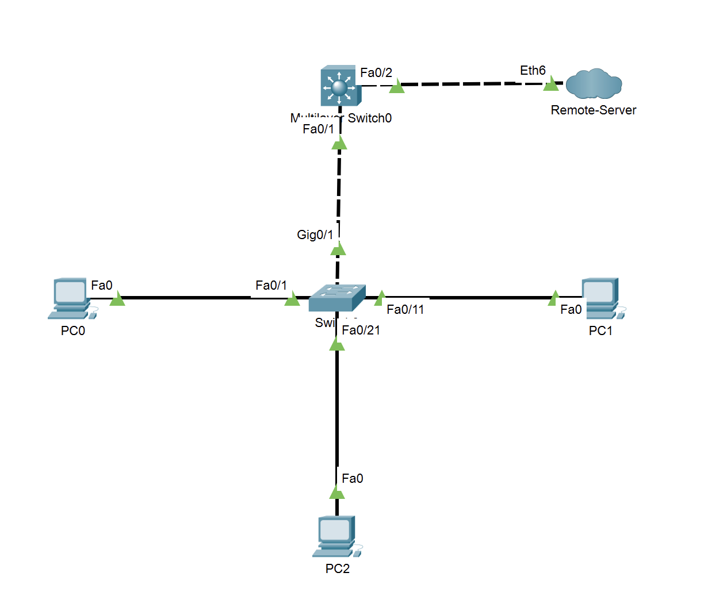
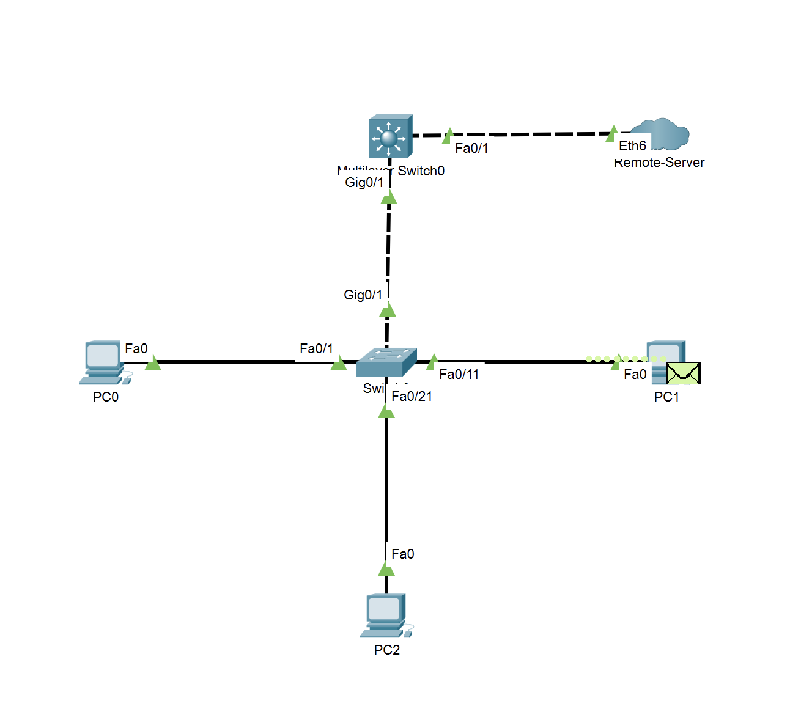

# Ex3

* 单臂路由

## 拓补图



## 交换机划分VLAN

* 配置过程

```log
Switch#conf t
Enter configuration commands, one per line.  End with CNTL/Z.
Switch(config)#host S1
S1(config)#vlan 10
S1(config-vlan)#name Finance
S1(config-vlan)#vlan 20
S1(config-vlan)#name Development
S1(config-vlan)#vlan 30
S1(config-vlan)#name Management
S1(config-vlan)#exit
S1(config)#
S1(config)#interface range f0/1-10
S1(config-if-range)#switchport mode access
S1(config-if-range)#switchport access vlan 10
S1(config-if-range)#
S1(config-if-range)#interface range f0/11-20
S1(config-if-range)#switchport mode access
S1(config-if-range)#switchport access vlan 20
S1(config-if-range)#
S1(config-if-range)#interface range f0/21-24
S1(config-if-range)#switchport mode access
S1(config-if-range)#switchport access vlan 30
S1(config-if-range)#end
S1#
%SYS-5-CONFIG_I: Configured from console by console

S1#conf t
Enter configuration commands, one per line.  End with CNTL/Z.
S1(config)#interface g0/1
S1(config-if)#switchport mode trunk

S1(config-if)#
%LINEPROTO-5-UPDOWN: Line protocol on Interface GigabitEthernet0/1, changed state to down

%LINEPROTO-5-UPDOWN: Line protocol on Interface GigabitEthernet0/1, changed state to up

S1(config-if)#
```

* 配置结果

```log
S1#show vlan

VLAN Name                             Status    Ports
---- -------------------------------- --------- -------------------------------
1    default                          active    Gig0/2
10   Finance                          active    Fa0/1, Fa0/2, Fa0/3, Fa0/4
                                                Fa0/5, Fa0/6, Fa0/7, Fa0/8
                                                Fa0/9, Fa0/10
20   Development                      active    Fa0/11, Fa0/12, Fa0/13, Fa0/14
                                                Fa0/15, Fa0/16, Fa0/17, Fa0/18
                                                Fa0/19, Fa0/20
30   Management                       active    Fa0/21, Fa0/22, Fa0/23, Fa0/24
1002 fddi-default                     active    
1003 token-ring-default               active    
1004 fddinet-default                  active    
1005 trnet-default                    active    

VLAN Type  SAID       MTU   Parent RingNo BridgeNo Stp  BrdgMode Trans1 Trans2
---- ----- ---------- ----- ------ ------ -------- ---- -------- ------ ------
1    enet  100001     1500  -      -      -        -    -        0      0
10   enet  100010     1500  -      -      -        -    -        0      0
20   enet  100020     1500  -      -      -        -    -        0      0
30   enet  100030     1500  -      -      -        -    -        0      0
1002 fddi  101002     1500  -      -      -        -    -        0      0   
1003 tr    101003     1500  -      -      -        -    -        0      0   
1004 fdnet 101004     1500  -      -      -        ieee -        0      0   
1005 trnet 101005     1500  -      -      -        ibm  -        0      0   

VLAN Type  SAID       MTU   Parent RingNo BridgeNo Stp  BrdgMode Trans1 Trans2
---- ----- ---------- ----- ------ ------ -------- ---- -------- ------ ------

Remote SPAN VLANs
------------------------------------------------------------------------------

Primary Secondary Type              Ports
------- --------- ----------------- ------------------------------------------
S1# 
```

## 路由器的子接口封装dot1q

> 由于使用三层交换机替代，故不使用子接口功能。

* 更名三层交换机为R1，并开启路由功能

```log
Switch0#conf t
Enter configuration commands, one per line.  End with CNTL/Z.
Switch0(config)#host R1
R1(config)#ip routing
```

### 使用VTP同步交换机VLAN信息

* S1配置如下

```log
S1(config)#vtp domain test
Changing VTP domain name from NULL to test
S1(config)#vtp mode server
Device mode already VTP SERVER.
S1(config)#vtp version 2
```

* R1配置如下

```log
R1(config)#vtp domain test
Domain name already set to test.
R1(config)#vtp mode client
Setting device to VTP CLIENT mode.
R1(config)#exit
%SYS-5-CONFIG_I: Configured from console by console

R1#show vtp status
VTP Version capable             : 1 to 2
VTP version running             : 2
VTP Domain Name                 : test
VTP Pruning Mode                : Disabled
VTP Traps Generation            : Disabled
Device ID                       : 0060.2F11.3800
Configuration last modified by 0.0.0.0 at 3-1-93 00:44:18

Feature VLAN : 
--------------
VTP Operating Mode                : Client
Maximum VLANs supported locally   : 1005
Number of existing VLANs          : 8
Configuration Revision            : 1
MD5 digest                        : 0xF8 0x34 0x69 0xB5 0x74 0xB3 0xAE 0xC7 
                                    0x6D 0x78 0xFD 0x43 0xFC 0x0B 0x8D 0xCE 

R1#conf t
Enter configuration commands, one per line.  End with CNTL/Z.
R1(config)#vtp mode server
Setting device to VTP SERVER mode.
R1(config)#
```

> 同步完成后需要关闭客户端VTP以继续配置。

### 配置VLANIP

```log
R1(config)#int vlan 10
%LINK-5-CHANGED: Interface Vlan10, changed state to up

%LINEPROTO-5-UPDOWN: Line protocol on Interface Vlan10, changed state to up

R1(config-if)#ip add 10.10.10.1 255.255.255.0
R1(config-if)#
R1(config-if)#int vlan 20
%LINK-5-CHANGED: Interface Vlan20, changed state to up

%LINEPROTO-5-UPDOWN: Line protocol on Interface Vlan20, changed state to up

R1(config-if)#ip add 10.10.20.1 255.255.255.0
R1(config-if)#
R1(config-if)#int vlan 30
%LINK-5-CHANGED: Interface Vlan30, changed state to up

%LINEPROTO-5-UPDOWN: Line protocol on Interface Vlan30, changed state to up

R1(config-if)#ip add 10.10.30.1 255.255.255.0
R1(config-if)#
```

### 对交换机**trunk端口**启用dot1q。

```log
R1#conf t
Enter configuration commands, one per line.  End with CNTL/Z.
R1(config)#int g0/1
R1(config-if)#switchport trunk encapsulation dot1q 
R1(config-if)#switchport mode trunk
```

## 路由器针对各个VLAN设置DHCP地址池

```log
R1(config)#ip dhcp pool v10
R1(dhcp-config)#network 10.10.10.0 255.255.255.0
R1(dhcp-config)#default-router 10.10.10.1
R1(dhcp-config)#ip dhcp pool v20
R1(dhcp-config)#network 10.10.20.0 255.255.255.0
R1(dhcp-config)#default-router 10.10.20.1
R1(dhcp-config)#end
R1#show ip dhcp binding
IP address       Client-ID/              Lease expiration        Type
                 Hardware address
10.10.10.2       0009.7C13.2A45           --                     Automatic
10.10.20.2       0002.4A32.C815           --                     Automatic
```

* 客户机使用DHCP获得地址，进行检测，PC2能ping通PC1

```log

Cisco Packet Tracer PC Command Line 1.0
C:\>ping 10.10.20.2

Pinging 10.10.20.2 with 32 bytes of data:

Reply from 10.10.20.2: bytes=32 time<1ms TTL=127
Reply from 10.10.20.2: bytes=32 time=3ms TTL=127
Reply from 10.10.20.2: bytes=32 time<1ms TTL=127
Reply from 10.10.20.2: bytes=32 time=4ms TTL=127

Ping statistics for 10.10.20.2:
    Packets: Sent = 4, Received = 4, Lost = 0 (0% loss),
Approximate round trip times in milli-seconds:
    Minimum = 0ms, Maximum = 4ms, Average = 1ms

C:\>
```


