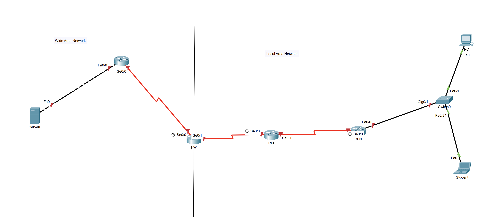

# Ex4

> 注意：这是一个未完成的实验。

静态路由 + 动态路由

## 拓补图及IP表



| 网段             | 网关        | VLAN | 部门    |
| ---------------- | ----------- | ---- | ------- |
| 172.16.0.8/29    | 172.16.0.10 | 10   | Finance |
| 172.16.0.16/29   | 172.16.0.20 | 20   | Product |
| 10.10.20.0/30    | -           | -    | -       |
| 10.10.10.0/30    | -           | -    | -       |
| 202.96.128.80/30 | -           | -    | -       |
| 202.96.128.84/30 | -           | -    | -       |

| 设备    | 接口 | IP          | 掩码 | 部门    |
| ------- | ---- | ----------- | ---- | ------- |
| PC      | -    | -           | -    | Finance |
| Student | -    | 172.16.0.22 | -    | Product |

| 设备   | 接口    | VLAN  | IP             |
| ------ | ------- | ----- | -------------- |
| SW     | g0/1    | trunk | -              |
|        | f0/1    | 10    | -              |
| RFN    | f0/0.10 | 10    | 172.16.0.10/29 |
|        | f0/0.20 | 20    | 172.16.0.20/29 |
| RM     |
| FW     | s0/1    | -     | 10.10.10.2/30  |
| ISP    |
| WEBDNS | -       | -     | 202.96.128.86  |

## 交换机配置VLAN（trunk配置，access到VLAN配置）

```log
Switch>ena
Switch#conf t
Enter configuration commands, one per line.  End with CNTL/Z.
Switch(config)#int g0/1
Switch(config-if)#switchport mode trunk
Switch(config-if)#
Switch(config-if)#int f0/1
Switch(config-if)#switchport mode access
Switch(config-if)#switchport access vlan 10
% Access VLAN does not exist. Creating vlan 10
Switch(config-if)#no shut
Switch(config-if)#
Switch(config)#int f0/24
Switch(config-if)#switchport mode access
Switch(config-if)#switchport access vlan 20
% Access VLAN does not exist. Creating vlan 20
Switch(config-if)#no shut
Switch(config-if)#
```

## RFN完成直连路由（也即实现单臂路由）

```log
RFN(config)#int f0/0.10
RFN(config-subif)#encapsulation dot1Q 10
RFN(config-subif)#ip address 172.16.0.10 255.255.255.248
RFN(config-subif)#int f0/0.20
RFN(config-subif)#encapsulation dot1Q 20
RFN(config-subif)#ip address 172.16.0.20 255.255.255.248
RFN(config-subif)#
```

## RM和RFN配置OSPF

* RM

```log
RM(config-subif)#router ospf 1
RM(config-router)#network 10.10.10.0 0.0.0.3 area 0
RM(config-router)#network 10.10.20.0 0.0.0.3 area 0
RM(config-router)#
```

* RFN

```log
RFN(config)#router ospf 1
RFN(config-router)#network 10.10.20.0 0.0.0.3 area 0
RFN(config-router)#network 172.16.0.16 0.0.0.7 area 0
RFN(config-router)#
```

## FW配置到internet的默认静态路由，ISP配置默认静态路由

```log
FW>ena 
FW#conf t
Enter configuration commands, one per line.  End with CNTL/Z.
FW(config)#ip route 0.0.0.0 0.0.0.0 s0/0
FW(config)#
```

## FW配置OSPF并进行缺省路由发布

```log
FW(config-router)#ip route 0.0.0.0 0.0.0.0 s0/0
FW(config)#router ospf 1
FW(config-router)#network 10.10.10.0 0.0.0.3 area 0
FW(config-router)#default-information originate
FW(config-router)#
```

## 进行连入互联网测试

```html
<html>
<center><font size='+2' color='blue'>Cisco Packet Tracer</font></center>
<hr>欢迎来到21网络工程4班网站! 
<p>Quick Links:
<br><a href='helloworld.htmI'>A small page</a>
<br><a href='copyrights.html'>Copyrights</a>
<br><a href='image.html'>lmage page</a>
<br><a href='cscoptlogo177x111.jpg'>lmage</a>
</html>
```
