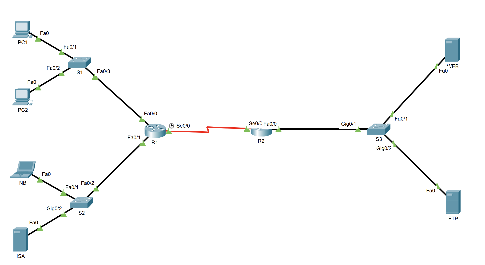

# Ex5

Extended ACL

## 拓补图及IP表



| 网段           | 网关        | 部门         |
| -------------- | ----------- | ------------ |
| 172.26.8.0/22  | 172.26.8.1  | Finance      |
| 172.26.12.0/22 | 172.26.12.1 | Product      |
| 172.16.0.8/29  | 172.16.0.9  | Management   |
| 10.10.10.0/30  | -           | （路由通信） |

| 主机 | IP           |
| ---- | ------------ |
| PC1  | 172.26.8.100 |
| PC2  | 172.26.8.101 |
| NB   | 172.26.12.15 |
| ISA  | 172.26.12.12 |
| WEB  | 172.16.0.10  |
| FTP  | 172.16.0.11  |

> 后续步骤需先在各设备中完成以上地址的配置

## R2路由器对于Finance与Product网络的路由总结

* 172.26.8.0/22 与172.26.12.0/22的路由总结为172.26.8.0/21

| 网段           | 二进制表示                          |
| -------------- | ----------------------------------- |
| 172.26.8.0/22  | 10101100 00011010 00001000 00000000 |
| 172.26.12.0/22 | 10101100 00011010 00001100 00000000 |

经过对比可知两个网段可以汇总为```172.26.8.0/21```

* 配置R1及R2的路由实现通信。

```log
R1>ena
R1#conf t
Enter configuration commands, one per line.  End with CNTL/Z.
R1(config)#ip route 172.16.0.8 255.255.255.248 10.10.10.2
R1(config)#
```

```log
R2>ena 
R2#conf t
Enter configuration commands, one per line.  End with CNTL/Z.
R2(config)#ip route 172.26.8.0 255.255.248.0 10.10.10.1
R2(config)#
```

## 使用Extended ACL进行HTTP协议的访问控制

```log
R1(config)#acc 100 permit tcp host 172.26.12.12 host 172.16.0.10 eq 80
R1(config)#
```

## 使用Extended ACL进行FTP协议的访问控制

```log
R1(config)#acc 100 permit tcp 172.26.8.0 0.0.3.255 host 172.16.0.11 eq 21
R1(config)#acc 100 permit tcp 172.26.8.0 0.0.3.255 host 172.16.0.11 eq 20
R1(config)#
```

## Extended ACL对于ICMP中Echo 与 Echo-reply 控制

```log
R1(config)#acc 100 permit icmp host 172.26.12.15 any echo
R1(config)#acc 100 permit icmp host 172.26.8.100 any echo-reply
R1(config)#
```

## Extended ACL对于其他协议类型的控制

```log
R1(config)#acc 100 deny ip any any
R1(config)#
```

## 随工验收

```log
R1#show acc
Extended IP access list 100
    10 permit tcp host 172.26.12.12 host 172.16.0.10 eq www
    20 permit tcp 172.26.8.0 0.0.3.255 host 172.16.0.11 eq ftp
    30 permit tcp 172.26.8.0 0.0.3.255 host 172.16.0.11 eq 20
    40 permit icmp host 172.26.12.15 any echo
    50 permit icmp host 172.26.8.100 any echo-reply
    60 deny ip any any

R1#
```
