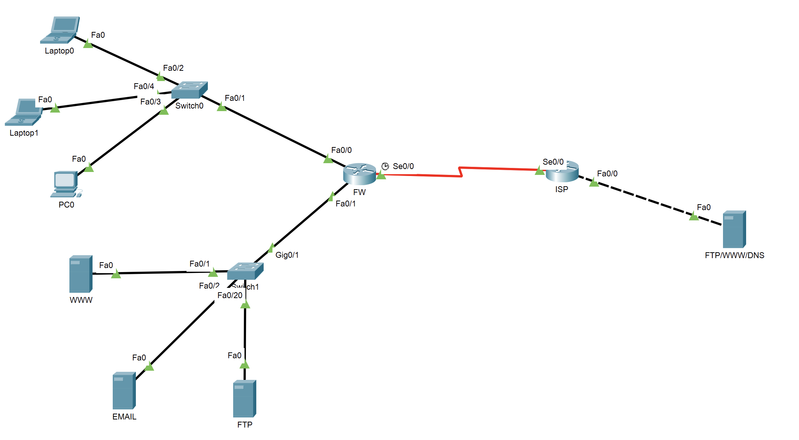

# Ex6

NAT 网络地址转换

## 拓补图及IP表

* 拓补图



* IP及网段信息

| 类型    | 网段             |
| ------- | ---------------- |
| Private | 172.31.0.0/16    |
| Private | 172.16.16.16/29  |
| Public  | 202.96.128.80/29 |
| Private | 10.10.10.8/30    |

| 主机        | IP           |
| ----------- | ------------ |
| Laptop0     | 172.31.0.2   |
| Laptop1     | 172.31.0.4   |
| PC0         | 172.31.0.3   |
| WWW         | 172.16.16.18 |
| EMAIL       | 172.16.16.22 |
| FTP         | 172.16.16.21 |
| FTP/WWW/DNS | 10.10.10.10  |

| 设备 | 接口 | IP            |
| ---- | ---- | ------------- |
| FW   | f0/0 | 172.16.16.17  |
|      | f0/1 | 172.16.16.17  |
|      | s0/0 | 202.96.128.85 |
| ISP  | f0/0 | 10.10.10.9    |
|      | s0/0 | 202.96.128.86 |

## 任务1

ISP机构使用静态NAT来实现内网IP（10.10.10.10/30）到公网IP（202.96.128.86/29）一对一映射

```log
ISP>ena
ISP#conf t
Enter configuration commands, one per line.  End with CNTL/Z.
ISP(config)#int f0/0
ISP(config-if)#ip nat inside
ISP(config-if)#int s0/0
ISP(config-if)#ip nat outside
ISP(config-if)#ip nat inside source static 10.10.10.10 202.96.128.86
ISP(config)#
```

## 任务2

内部非服务器区域使用动态映射实现 172.31.0.0/16 通过LIST映射到POOL（202.96.128.81~84） 上网

```log
FW>ena
FW#conf t
Enter configuration commands, one per line.  End with CNTL/Z.
FW(config)#acc 1 permit 172.31.0.0 0.0.255.255
FW(config)#ip nat pool forinter 202.96.128.81 202.96.128.84 netmask 255.255.255.248
FW(config)#ip nat inside source list 1 pool forinter
FW(config)#
```

## 任务3

针对公司内部的WWW、DNS、FTP、FTP等服务做PAT端口映射，使互联网通过企业公网ip202.96.128.85访问企业网络服务

```log
FW(config)#ip nat inside source static tcp 172.16.16.18 80 202.96.128.85 80
FW(config)#ip nat inside source static tcp 172.16.16.18 443 202.96.128.85 443
FW(config)#ip nat inside source static tcp 172.16.16.18 8080 202.96.128.85 8080
FW(config)#ip nat inside source static udp 172.16.16.18 53 202.96.128.85 53
FW(config)#ip nat inside source static tcp 172.16.16.18 21 202.96.128.85 21
FW(config)#ip nat inside source static tcp 172.16.16.18 20 202.96.128.85 20
FW(config)#ip nat inside source static tcp 172.16.16.18 25 202.96.128.85 25
FW(config)#ip nat inside source static tcp 172.16.16.18 110 202.96.128.85 110
FW(config)#
```

## 任务4

请注意观察每种NAT方式的映射情况 show ip nat translations

```log
FW#show ip nat translations
Pro  Inside global     Inside local       Outside local      Outside global
udp 202.96.128.85:53   172.16.16.18:53    ---                ---
tcp 202.96.128.85:110  172.16.16.18:110   ---                ---
tcp 202.96.128.85:20   172.16.16.18:20    ---                ---
tcp 202.96.128.85:21   172.16.16.18:21    ---                ---
tcp 202.96.128.85:25   172.16.16.18:25    ---                ---
tcp 202.96.128.85:443  172.16.16.18:443   ---                ---
tcp 202.96.128.85:8080 172.16.16.18:8080  ---                ---
tcp 202.96.128.85:80   172.16.16.18:80    ---                ---

FW#
```
